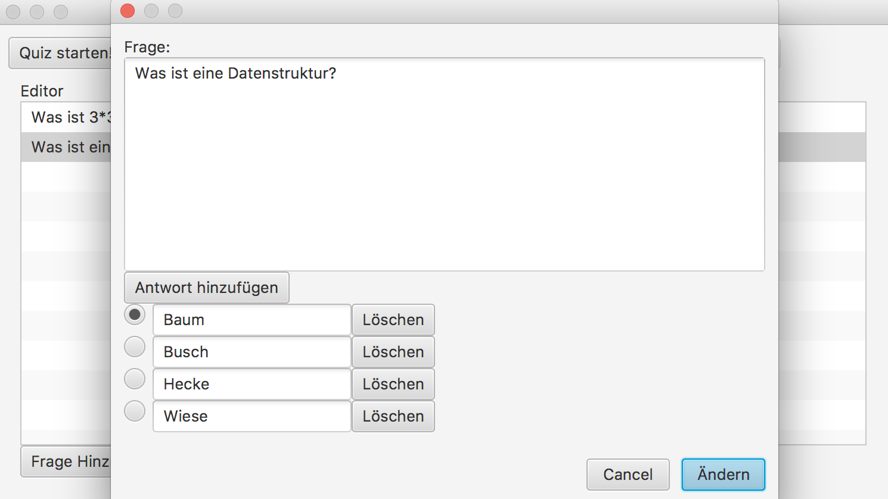

## QuizApp

The Java quiz application structured in the MVP model that can create new quizzes, edit or delete
them, undo or redo these functionalities, and record results as well as the number of answers to each quiz.
The graphical user interface is supported by the JavaFX library

